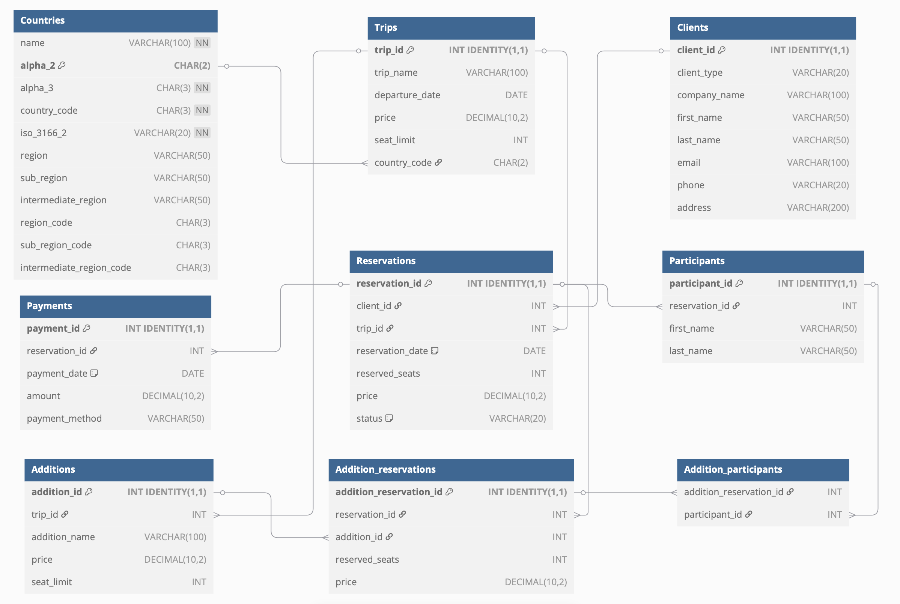

# Bazy danych

**Autorzy:** Rutyna Przemysław, Skoczylas Piotr, Bryzek Przemysław


---

# 1. Wymagania i funkcje systemu

## Opis ogólny
System służy do zarządzania rezerwacjami w biurze podróży. Pozwala klientom na rezerwowanie wycieczek oraz powiązanych dodatków (np. atrakcje, sprzęt, usługi), a pracownikom biura na kompleksowe zarządzanie ofertą, klientami oraz obsługę rezerwacji i płatności.

---

## Funkcjonalności dla klientów:
- Przeglądanie dostępnych wycieczek i dodatków (np. atrakcje, sprzęt).
- Składanie rezerwacji na wybraną wycieczkę (wskazanie liczby miejsc).
- Dodawanie dodatków do rezerwacji (np. wynajem sprzętu, udział w dodatkowych atrakcjach).
- Anulowanie rezerwacji i zwrot pieniędz.
- Przypisywanie uczestników do rezerwacji i do wybranych dodatków.
- Podgląd statusu własnych rezerwacji, płatności i historii wyjazdów.

---

## Funkcjonalności dla pracowników biura podróży:
- Dodawanie i edycja oferty wycieczek (nazwa, data, cena, limit miejsc).
- Zarządzanie dodatkami do wycieczek (np. nowe atrakcje, limity, ceny).
- Podgląd oraz szczegółowa obsługa wszystkich rezerwacji — możliwość modyfikacji, anulowania, przypisywania uczestników.
- Rejestracja i obsługa płatności, generowanie raportów rozliczeniowych.
- Kontrola dostępności miejsc (synchronizacja liczby uczestników z limitem).
- Raporty sprzedaży (np. miesięczne, roczne), analiza popularności wycieczek i dodatków.
- Obsługa zwrotów i anulacji (z uwzględnieniem terminów i polityki zwrotów).

---

## Wymagania niefunkcjonalne:
- Spójność danych (np. nie można dodać uczestnika ponad liczbę zarezerwowanych miejsc).
- Automatyczne anulowanie nieopłaconych lub niekompletnych rezerwacji przed wyjazdem.
- Przejrzysty, zgodny z RODO podgląd danych klientów (np. osobne widoki bez wrażliwych danych).
- Rozszerzalność rozwiązania (możliwość dodania nowych typów atrakcji, raportów, kanałów płatności).
- Bezpieczna rejestracja płatności i zwrotów (np. historia transakcji, saldo rezerwacji).
- Przejrzysty podział ról użytkowników (klient/pracownik biura).

---

## Procesy biznesowe:
1. Klient przegląda ofertę i wybiera wycieczkę.
2. Składa rezerwację, określając liczbę uczestników.
3. Dodaje wybrane dodatki do rezerwacji.
4. Przypisuje uczestników do rezerwacji oraz do konkretnych dodatków.
5. Opłaca rezerwację.
6. System monitoruje kompletność uczestników i płatności — w razie braków automatycznie anuluje rezerwację.
7. Pracownik ma pełny wgląd i możliwość interwencji na każdym etapie (np. ręczna edycja, zwroty, generowanie raportów).

---

# 2. Baza danych

## Schemat bazy danych



## Opis poszczególnych tabel

### Tabela: Clients
- Opis: Przechowuje dane klientów (osoby indywidualne lub firmy).

| Nazwa atrybutu | Typ           | Opis/Uwagi                                         |
| -------------- | ------------- | -------------------------------------------------- |
| client_id      | INT           | Klucz główny, autoinkrementacja                    |
| client_type    | VARCHAR(20)   | Typ klienta: 'individual' lub 'company'            |
| company_name   | VARCHAR(100)  | Nazwa firmy (dla firm)                             |
| first_name     | VARCHAR(50)   | Imię (dla osób indywidualnych)                     |
| last_name      | VARCHAR(50)   | Nazwisko (dla osób indywidualnych)                 |
| email          | VARCHAR(100)  | E-mail                                             |
| phone          | VARCHAR(20)   | Telefon                                            |
| address        | VARCHAR(200)  | Adres                                              |

```sql
CREATE TABLE "Clients" (
    "client_id" INT IDENTITY(1,1) PRIMARY KEY,
    "client_type" VARCHAR(20) CHECK (client_type IN ('individual', 'company')),
    "company_name" VARCHAR(100),
    "first_name" VARCHAR(50),
    "last_name" VARCHAR(50),
    "email" VARCHAR(100),
    "phone" VARCHAR(20),
    "address" VARCHAR(200)
);
```

---

### Tabela: Trips
- Opis: Przechowuje informacje o dostępnych wycieczkach.

| Nazwa atrybutu   | Typ           | Opis/Uwagi         |
| ---------------- | ------------- | ------------------ |
| trip_id          | INT           | Klucz główny       |
| trip_name        | VARCHAR(100)  | Nazwa wycieczki    |
| departure_date   | DATE          | Data wyjazdu       |
| price            | DECIMAL(10,2) | Cena               |
| seat_limit       | INT           | Limit miejsc       |

```sql
CREATE TABLE "Trips" (
    "trip_id" INT IDENTITY(1,1) PRIMARY KEY,
    "trip_name" VARCHAR(100),
    "departure_date" DATE,
    "price" DECIMAL(10, 2),
    "seat_limit" INT
);
```

---

### Tabela: Reservations
- Opis: Przechowuje rezerwacje wycieczek klientów.

| Nazwa atrybutu  | Typ           | Opis/Uwagi                            |
| --------------- | ------------- | ------------------------------------- |
| reservation_id  | INT           | Klucz główny                          |
| client_id       | INT           | Klucz obcy do Clients                 |
| trip_id         | INT           | Klucz obcy do Trips                   |
| reservation_date| DATE          | Data rezerwacji (domyślnie dziś)      |
| reserved_seats  | INT           | Liczba zarezerwowanych miejsc         |
| price           | DECIMAL(10,2) | Cena                                  |
| status          | VARCHAR(20)   | Status: 'pending', 'cancelled'        |

```sql
CREATE TABLE "Reservations" (
    "reservation_id" INT IDENTITY(1,1) PRIMARY KEY,
    "client_id" INT,
    "trip_id" INT,
    "reservation_date" DATE DEFAULT CAST(GETDATE() AS DATE),
    "reserved_seats" INT,
    "price" DECIMAL(10,2),
    "status" VARCHAR(20) DEFAULT 'pending' CHECK (status IN ('pending', 'cancelled')),
    FOREIGN KEY ("client_id") REFERENCES Clients("client_id"),
    FOREIGN KEY ("trip_id") REFERENCES Trips("trip_id")
);
```

---

### Tabela: Participants
- Opis: Przechowuje uczestników przypisanych do rezerwacji.

| Nazwa atrybutu  | Typ           | Opis/Uwagi                    |
| --------------- | ------------- | ----------------------------- |
| participant_id  | INT           | Klucz główny                  |
| reservation_id  | INT           | Klucz obcy do Reservations    |
| first_name      | VARCHAR(50)   | Imię uczestnika               |
| last_name       | VARCHAR(50)   | Nazwisko uczestnika           |

```sql
CREATE TABLE "Participants" (
    "participant_id" INT IDENTITY(1,1) PRIMARY KEY,
    "reservation_id" INT,
    "first_name" VARCHAR(50),
    "last_name" VARCHAR(50),
    FOREIGN KEY ("reservation_id") REFERENCES Reservations("reservation_id")
);
```

---

### Tabela: Additions
- Opis: Dodatkowe atrakcje lub usługi powiązane z wycieczkami.

| Nazwa atrybutu    | Typ           | Opis/Uwagi                     |
| ----------------- | ------------- | ------------------------------ |
| addition_id       | INT           | Klucz główny                   |
| trip_id           | INT           | Klucz obcy do Trips            |
| addition_name     | VARCHAR(100)  | Nazwa dodatku                  |
| price             | DECIMAL(10,2) | Cena dodatku                   |
| seat_limit        | INT           | Limit miejsc                   |

```sql
CREATE TABLE "Additions" (
    "addition_id" INT IDENTITY(1,1) PRIMARY KEY,
    "trip_id" INT,
    "addition_name" VARCHAR(100),
    "price" DECIMAL(10,2),
    "seat_limit" INT,
    FOREIGN KEY ("trip_id") REFERENCES Trips("trip_id")
);
```

---

### Tabela: Addition_reservations
- Opis: Rezerwacje dodatków do rezerwacji głównych.

| Nazwa atrybutu          | Typ           | Opis/Uwagi                              |
| ----------------------- | ------------- | --------------------------------------- |
| addition_reservation_id | INT           | Klucz główny                            |
| reservation_id          | INT           | Klucz obcy do Reservations              |
| addition_id             | INT           | Klucz obcy do Additions                 |
| reserved_seats          | INT           | Ilość zarezerwowanych miejsc            |
| price                   | DECIMAL(10,2) | Cena                                    |

```sql
CREATE TABLE "Addition_reservations" (
    "addition_reservation_id" INT IDENTITY(1,1) PRIMARY KEY,
    "reservation_id" INT,
    "addition_id" INT,
    "reserved_seats" INT,
    "price" DECIMAL(10,2),
    FOREIGN KEY ("reservation_id") REFERENCES Reservations("reservation_id"),
    FOREIGN KEY ("addition_id") REFERENCES Additions("addition_id")
);
```

---

### Tabela: Addition_participants
- Opis: Mapowanie uczestników na dodatki.

| Nazwa atrybutu           | Typ | Opis/Uwagi                            |
| ------------------------ | --- | ------------------------------------- |
| addition_reservation_id  | INT | Klucz obcy do Addition_reservations   |
| participant_id           | INT | Klucz obcy do Participants            |

```sql
CREATE TABLE "Addition_participants" (
    "addition_reservation_id" INT,
    "participant_id" INT,
    FOREIGN KEY ("addition_reservation_id") REFERENCES Addition_reservations("addition_reservation_id"),
    FOREIGN KEY ("participant_id") REFERENCES Participants("participant_id")
);
```

---

### Tabela: Payments
- Opis: Płatności powiązane z rezerwacjami.

| Nazwa atrybutu   | Typ           | Opis/Uwagi                      |
| ---------------- | ------------- | ------------------------------- |
| payment_id       | INT           | Klucz główny                    |
| reservation_id   | INT           | Klucz obcy do Reservations      |
| payment_date     | DATE          | Data płatności (domyślnie dziś) |
| amount           | DECIMAL(10,2) | Kwota                           |
| payment_method   | VARCHAR(50)   | Metoda płatności                |

```sql
CREATE TABLE "Payments" (
    "payment_id" INT IDENTITY(1,1) PRIMARY KEY,
    "reservation_id" INT,
    "payment_date" DATE DEFAULT CAST(GETDATE() AS DATE),
    "amount" DECIMAL(10, 2),
    "payment_method" VARCHAR(50),
    FOREIGN KEY ("reservation_id") REFERENCES Reservations("reservation_id")
);
```

---

# 3. Widoki, procedury/funkcje, triggery

## Widoki
- `additions_performance_report` - Analizuje popularność i rentowność dodatkowych atrakcji.
    ```sql
    CREATE VIEW additions_performance_report AS
    SELECT 
        a.addition_id,
        a.addition_name,
        a.price,
        a.seat_limit,
        t.trip_name,
        COUNT(ar.addition_reservation_id) AS total_reservations,
        SUM(ar.reserved_seats) AS total_seats_sold,
        a.seat_limit - SUM(ar.reserved_seats) AS remaining_seats,
        CAST(SUM(ar.reserved_seats) AS FLOAT) / a.seat_limit * 100 AS utilization_percentage,
        SUM(ar.reserved_seats * ar.price) AS total_revenue,
        AVG(CAST(ar.reserved_seats AS FLOAT)) AS avg_seats_per_reservation,
        CAST(COUNT(ar.addition_reservation_id) AS FLOAT) / 
        NULLIF((SELECT COUNT(r.reservation_id) 
                FROM Reservations r 
                WHERE r.trip_id = t.trip_id AND r.status <> 'cancelled'), 0) * 100 AS attachment_rate,
        (SELECT COUNT(ap.participant_id) 
        FROM Addition_participants ap 
        WHERE ap.addition_reservation_id IN 
            (SELECT ar2.addition_reservation_id 
                FROM Addition_reservations ar2 
                WHERE ar2.addition_id = a.addition_id)
        ) AS total_participants,
        CASE 
            WHEN SUM(ar.reserved_seats) >= a.seat_limit THEN 'Wyprzedana'
            WHEN SUM(ar.reserved_seats) >= a.seat_limit * 0.8 THEN 'Prawie pełna'
            ELSE 'Dostępna'
        END AS availability_status
        FROM Additions a
    JOIN Trips t ON a.trip_id = t.trip_id
    LEFT JOIN Addition_reservations ar ON a.addition_id = ar.addition_id
    LEFT JOIN Reservations r ON ar.reservation_id = r.reservation_id AND r.status <> 'cancelled'
    GROUP BY a.addition_id, a.addition_name, a.price, a.seat_limit, t.trip_name, t.trip_id;
    ```
- `clients_public` - Udostępnia podstawowe informacje o klientach bez wrażliwych danych jak adres email czy pełny adres.
    ```sql
    CREATE VIEW clients_public AS
    SELECT 
        client_id,
        client_type,
        CASE 
            WHEN client_type = 'individual' THEN first_name + ' ' + last_name
            ELSE company_name
        END AS display_name,
        phone
    FROM Clients;
    ```
 - `monthly_sales_report` - Agreguje miesięczne statystyki sprzedaży dla analiz trendów i planowania.
    ```sql
    CREATE VIEW monthly_sales_report AS
    SELECT 
        YEAR(r.reservation_date) AS year,
        MONTH(r.reservation_date) AS month,
        DATENAME(month, r.reservation_date) + ' ' + CAST(YEAR(r.reservation_date) AS VARCHAR) AS month_year,
        COUNT(r.reservation_id) AS total_reservations,
        SUM(r.reserved_seats) AS total_seats_sold,
        COUNT(DISTINCT r.client_id) AS unique_clients,
        SUM(dbo.get_total_reservation_cost(r.reservation_id)) AS total_revenue,
        SUM(dbo.get_total_payment(r.reservation_id)) AS total_payments_received,
        SUM(dbo.get_total_reservation_cost(r.reservation_id) - dbo.get_total_payment(r.reservation_id)) AS outstanding_balance,
        AVG(CAST(dbo.get_total_reservation_cost(r.reservation_id) AS FLOAT)) AS avg_reservation_value,
        AVG(CAST(r.reserved_seats AS FLOAT)) AS avg_seats_per_reservation
    FROM Reservations r
    WHERE r.status <> 'cancelled'
        AND r.reservation_date >= DATEADD(year, -2, GETDATE())
    GROUP BY YEAR(r.reservation_date), MONTH(r.reservation_date), DATENAME(month, r.reservation_date);
    ```
- `participants_with_trip` - Upraszcza dostęp do informacji o uczestnikach wraz z kontekstem wycieczki.
    ```sql
    CREATE VIEW participants_with_trip AS
    SELECT 
        p.participant_id,
        p.first_name,
        p.last_name,
        p.first_name + ' ' + p.last_name AS full_name,
        r.reservation_id,
        r.reservation_date,
        r.status AS reservation_status,
        CASE 
            WHEN c.client_type = 'individual' THEN c.first_name + ' ' + c.last_name
            ELSE c.company_name
        END AS client_name,
        c.phone AS client_phone,
        t.trip_id,
        t.trip_name,
        t.departure_date,
        t.price AS trip_price,
        DATEDIFF(day, GETDATE(), t.departure_date) AS days_until_departure
    FROM Participants p
    JOIN Reservations r ON p.reservation_id = r.reservation_id
    JOIN Clients c ON r.client_id = c.client_id
    JOIN Trips t ON r.trip_id = t.trip_id;
    ```
- `payments_report` - Analizuje przepływy finansowe według metod płatności i okresów.
    ```sql
    CREATE VIEW payments_report AS
    SELECT 
        YEAR(p.payment_date) AS year,
        MONTH(p.payment_date) AS month,
        DATENAME(month, p.payment_date) + ' ' + CAST(YEAR(p.payment_date) AS VARCHAR) AS month_year,
        p.payment_method,
        COUNT(p.payment_id) AS total_payments,
        SUM(p.amount) AS total_amount,
        AVG(p.amount) AS avg_payment_amount,
        SUM(CASE WHEN p.amount < 0 THEN 1 ELSE 0 END) AS refund_count,
        SUM(CASE WHEN p.amount < 0 THEN p.amount ELSE 0 END) AS total_refunds,
        SUM(CASE WHEN p.amount > 0 THEN p.amount ELSE 0 END) AS total_incoming,
        SUM(CASE WHEN p.amount > 0 THEN p.amount ELSE 0 END) + 
        SUM(CASE WHEN p.amount < 0 THEN p.amount ELSE 0 END) AS net_payments
    FROM Payments p
    WHERE p.payment_date >= DATEADD(year, -2, GETDATE())
    GROUP BY YEAR(p.payment_date), MONTH(p.payment_date), DATENAME(month, p.payment_date), p.payment_method;
    ```
- `reservations_full` - Kompleksowy widok łączący wszystkie kluczowe informacje o rezerwacji w jednym miejscu.
    ```sql
    CREATE VIEW reservations_full AS
    SELECT 
        r.reservation_id,
        r.reservation_date,
        r.status,
        c.client_id,
        CASE 
            WHEN c.client_type = 'individual' THEN c.first_name + ' ' + c.last_name
            ELSE c.company_name
        END AS client_name,
        c.client_type,
        c.email,
        c.phone,
        t.trip_id,
        t.trip_name,
        t.departure_date,
        r.reserved_seats,
        r.price AS unit_price,
        r.reserved_seats * r.price AS total_trip_cost,
        dbo.get_total_reservation_cost(r.reservation_id) AS total_cost_with_additions,
        dbo.get_total_payment(r.reservation_id) AS total_paid,
        dbo.get_total_reservation_cost(r.reservation_id) - dbo.get_total_payment(r.reservation_id) AS balance_due,
        CASE 
            WHEN dbo.get_total_payment(r.reservation_id) >= dbo.get_total_reservation_cost(r.reservation_id) 
            THEN 'Opłacone'
            WHEN dbo.get_total_payment(r.reservation_id) > 0 
            THEN 'Częściowo opłacone'
            ELSE 'Nieopłacone'
        END AS payment_status
    FROM Reservations r
    JOIN Clients c ON r.client_id = c.client_id
    JOIN Trips t ON r.trip_id = t.trip_id;
    ```
 - `trip_popularity_report` - Analizuje popularność i rentowność poszczególnych wycieczek.
    ```sql
    CREATE VIEW trip_popularity_report AS
    SELECT 
        t.trip_id,
        t.trip_name,
        t.departure_date,
        t.price,
        t.seat_limit,
        COUNT(r.reservation_id) AS total_reservations,
        SUM(r.reserved_seats) AS total_seats_sold,
        t.seat_limit - SUM(r.reserved_seats) AS remaining_seats,
        CAST(SUM(r.reserved_seats) AS FLOAT) / t.seat_limit * 100 AS occupancy_percentage,
        SUM(dbo.get_total_reservation_cost(r.reservation_id)) AS total_revenue,
        AVG(CAST(dbo.get_total_reservation_cost(r.reservation_id) AS FLOAT)) AS avg_reservation_value,
        (SELECT COUNT(DISTINCT ar.addition_id) 
        FROM Addition_reservations ar 
        JOIN Reservations r2 ON ar.reservation_id = r2.reservation_id 
        WHERE r2.trip_id = t.trip_id
        ) AS unique_additions_sold,
        (SELECT SUM(ar.reserved_seats * ar.price) 
        FROM Addition_reservations ar 
        JOIN Reservations r2 ON ar.reservation_id = r2.reservation_id 
        WHERE r2.trip_id = t.trip_id
        ) AS additions_revenue,
        CASE 
            WHEN t.departure_date < GETDATE() THEN 'Zakończona'
            WHEN SUM(r.reserved_seats) >= t.seat_limit THEN 'Wyprzedana'
            WHEN SUM(r.reserved_seats) >= t.seat_limit * 0.8 THEN 'Prawie pełna'
            ELSE 'Dostępna'
        END AS trip_status
    FROM Trips t
    LEFT JOIN Reservations r ON t.trip_id = r.trip_id AND r.status <> 'cancelled'
    GROUP BY t.trip_id, t.trip_name, t.departure_date, t.price, t.seat_limit;
    ```
- `trips_basic` - Pokazuje publiczne informacje o wycieczkach bez ujawniania wrażliwych danych biznesowych.
    ```sql
    CREATE VIEW trips_basic AS
    SELECT 
        trip_id,
        trip_name,
        departure_date,
        price,
        dbo.get_free_trip_seats(trip_id) AS available_seats,
        CASE 
            WHEN departure_date > GETDATE() THEN 'Dostępna'
            ELSE 'Zakończona'
        END AS status
    FROM Trips
    WHERE departure_date >= DATEADD(day, -30, GETDATE()); 
    ```
- `upcoming_departures_report` - Monitoring statusu przygotowań do nadchodzących wyjazdów.
    ```sql
    CREATE VIEW upcoming_departures_report AS
    SELECT 
        t.trip_id,
        t.trip_name,
        t.departure_date,
        DATEDIFF(day, GETDATE(), t.departure_date) AS days_until_departure,
        t.seat_limit,
        SUM(r.reserved_seats) AS seats_sold,
        t.seat_limit - SUM(r.reserved_seats) AS seats_available,
        COUNT(r.reservation_id) AS total_reservations,
        COUNT(DISTINCT r.client_id) AS unique_clients,
        (SELECT COUNT(p.participant_id) 
        FROM Participants p 
        JOIN Reservations r2 ON p.reservation_id = r2.reservation_id 
        WHERE r2.trip_id = t.trip_id AND r2.status <> 'cancelled'
        ) AS participants_assigned,
        SUM(r.reserved_seats) - (SELECT COUNT(p.participant_id) 
                                FROM Participants p 
                                JOIN Reservations r2 ON p.reservation_id = r2.reservation_id 
                                WHERE r2.trip_id = t.trip_id AND r2.status <> 'cancelled'
                            ) AS participants_missing,

        SUM(dbo.get_total_reservation_cost(r.reservation_id)) AS total_revenue_expected,
        SUM(dbo.get_total_payment(r.reservation_id)) AS total_payments_received,
        SUM(dbo.get_total_reservation_cost(r.reservation_id) - dbo.get_total_payment(r.reservation_id)) AS outstanding_balance,
        CASE 
            WHEN DATEDIFF(day, GETDATE(), t.departure_date) <= 7 
                AND SUM(dbo.get_total_reservation_cost(r.reservation_id) - dbo.get_total_payment(r.reservation_id)) > 0
            THEN 'Problemy płatności'
            WHEN DATEDIFF(day, GETDATE(), t.departure_date) <= 7 
                AND SUM(r.reserved_seats) - (SELECT COUNT(p.participant_id) 
                                            FROM Participants p 
                                            JOIN Reservations r2 ON p.reservation_id = r2.reservation_id 
                                            WHERE r2.trip_id = t.trip_id AND r2.status <> 'cancelled') > 0
            THEN 'Brak uczestników'
            WHEN DATEDIFF(day, GETDATE(), t.departure_date) <= 7
            THEN 'Gotowa'
            ELSE 'W przygotowaniu'
        END AS readiness_status
    FROM Trips t
    LEFT JOIN Reservations r ON t.trip_id = r.trip_id AND r.status <> 'cancelled'
    WHERE t.departure_date >= GETDATE()
        AND t.departure_date <= DATEADD(day, 60, GETDATE())
    GROUP BY t.trip_id, t.trip_name, t.departure_date, t.seat_limit;
    ```

## Procedury/funkcje

### Funkcje
- `get_free_addition_seats` - Zwraca liczbę wolnych miejsc na daną dodatkową atrakcję.
  ```sql
  CREATE FUNCTION get_free_addition_seats (@addition_id INT)
  RETURNS INT
  AS
  BEGIN
      DECLARE @seat_limit INT;
      DECLARE @reserved_seats INT;
      SELECT @seat_limit = seat_limit FROM Additions WHERE addition_id = @addition_id;
      SELECT @reserved_seats = ISNULL(SUM(ar.reserved_seats), 0)
      FROM Addition_reservations ar
      JOIN Reservations r ON ar.reservation_id = r.reservation_id
      WHERE ar.addition_id = @addition_id AND r.status <> 'cancelled';
      RETURN @seat_limit - @reserved_seats;
  END;
  ```
- `get_free_trip_seats` - Zwraca liczbę wolnych miejsc na daną wycieczkę.
  ```sql
  CREATE FUNCTION get_free_trip_seats (@trip_id INT)
  RETURNS INT
  AS
  BEGIN
      DECLARE @seat_limit INT;
      DECLARE @reserved_seats INT;
      SELECT @seat_limit = seat_limit FROM Trips WHERE trip_id = @trip_id;
      SELECT @reserved_seats = ISNULL(SUM(reserved_seats), 0)
      FROM Reservations
      WHERE trip_id = @trip_id AND status <> 'cancelled';
      RETURN @seat_limit - @reserved_seats;
  END;
  ```
- `get_total_payment` - Zwraca sumę wpłat dla danej rezerwacji.
  ```sql
  CREATE FUNCTION get_total_payment (@reservation_id INT)
  RETURNS DECIMAL(10,2)
  AS
  BEGIN
      DECLARE @total DECIMAL(10,2);
      SELECT @total = ISNULL(SUM(amount), 0)
      FROM Payments
      WHERE reservation_id = @reservation_id;
      RETURN @total;
  END;
  ```
- `get_total_reservation_cost` - Oblicza całkowity koszt rezerwacji (wycieczka + dodatki).
  ```sql
  CREATE FUNCTION get_total_reservation_cost (@reservation_id INT)
  RETURNS DECIMAL(10,2)
  AS
  BEGIN
      DECLARE @base_price DECIMAL(10,2);
      DECLARE @reserved_seats INT;
      DECLARE @unit_price DECIMAL(10,2);
      DECLARE @additions_price DECIMAL(10,2);

      SELECT @unit_price = price, @reserved_seats = reserved_seats
      FROM Reservations
      WHERE reservation_id = @reservation_id;

      SELECT @additions_price = ISNULL(SUM(price * reserved_seats), 0)
      FROM Addition_reservations
      WHERE reservation_id = @reservation_id;

      RETURN ISNULL(@unit_price * @reserved_seats, 0) + @additions_price;
  END;
  ```
- `get_client_reservations` - Zwraca tabelę ze wszystkimi rezerwacjami danego klienta.
  ```sql
  CREATE FUNCTION get_client_reservations (@client_id INT)
  RETURNS TABLE
  AS
  RETURN
  (
      SELECT
          R.reservation_id,
          T.trip_name,
          T.departure_date,
          R.reserved_seats,
          R.price AS reservation_price,
          R.status AS reservation_status,
          R.reservation_date
      FROM Reservations R
      JOIN Trips T ON R.trip_id = T.trip_id
      WHERE R.client_id = @client_id
  );
  ```
- `get_client_participants` - Zwraca tabelę ze wszystkimi uczestnikami powiązanymi z rezerwacjami danego klienta.
  ```sql
  CREATE FUNCTION get_client_participants (@client_id INT)
  RETURNS TABLE
  AS
  RETURN
  (
      SELECT
          P.first_name AS participant_first_name,
          P.last_name AS participant_last_name,
          T.trip_name,
          R.reservation_id
      FROM Participants P
      JOIN Reservations R ON P.reservation_id = R.reservation_id
      JOIN Trips T ON R.trip_id = T.trip_id
      WHERE R.client_id = @client_id
  );
  ```
- `get_client_payments` - Zwraca tabelę ze wszystkimi płatnościami dokonanymi przez danego klienta.
  ```sql
  CREATE FUNCTION get_client_payments (@client_id INT)
  RETURNS TABLE
  AS
  RETURN
  (
      SELECT
          P.payment_id,
          R.reservation_id,
          P.payment_date,
          P.amount,
          P.payment_method,
          T.trip_name
      FROM Payments P
      JOIN Reservations R ON P.reservation_id = R.reservation_id
      JOIN Trips T ON R.trip_id = T.trip_id
      WHERE R.client_id = @client_id
  );
  ```
- `get_available_trips` - Zwraca tabelę wszystkich wycieczek, które mają obecnie dostępne miejsca.
  ```sql
  CREATE FUNCTION get_available_trips ()
  RETURNS TABLE
  AS
  RETURN
  (
      SELECT
          T.trip_id,
          T.trip_name,
          T.departure_date,
          T.price,
          dbo.get_free_trip_seats(T.trip_id) AS remaining_seats
      FROM Trips T
      WHERE dbo.get_free_trip_seats(T.trip_id) > 0
  );
  ```
- `get_trip_additions` - Zwraca tabelę dostępnych dodatków dla konkretnej wycieczki.
  ```sql
  CREATE FUNCTION get_trip_additions (@trip_id INT)
  RETURNS TABLE
  AS
  RETURN
  (
      SELECT
          A.addition_id,
          A.addition_name,
          A.price,
          dbo.get_free_addition_seats(A.addition_id) AS remaining_seats
      FROM Additions A
      WHERE A.trip_id = @trip_id AND dbo.get_free_addition_seats(A.addition_id) > 0
  );
  ```

### Procedury
- `add_addition_participant` - Dodaje uczestnika do zarezerwowanej dodatkowej atrakcji.
  ```sql
  CREATE PROCEDURE add_addition_participant
      @addition_reservation_id INT,
      @participant_id INT
  AS
  BEGIN
      SET NOCOUNT ON;
      IF NOT EXISTS (SELECT 1 FROM Addition_reservations WHERE addition_reservation_id = @addition_reservation_id)
      BEGIN
          RAISERROR('Addition reservation not found.', 16, 1);
          RETURN;
      END
      DECLARE @current_participants INT;
      SELECT @current_participants = COUNT(*)
      FROM Addition_participants
      WHERE addition_reservation_id = @addition_reservation_id;

      DECLARE @reserved_seats INT;
      SELECT @reserved_seats = reserved_seats
      FROM Addition_reservations
      WHERE addition_reservation_id = @addition_reservation_id;
      IF @current_participants >= @reserved_seats
      BEGIN
          RAISERROR('Cannot add more participants than reserved seats for this addition.', 16, 1);
          RETURN;
      END
      IF NOT EXISTS (SELECT 1 FROM Participants WHERE participant_id = @participant_id)
      BEGIN
          RAISERROR('Participant not found.', 16, 1);
          RETURN;
      END
      DECLARE @reservation_id_addition INT;
      DECLARE @reservation_id_participant INT;

      SELECT @reservation_id_addition = reservation_id FROM Addition_reservations WHERE addition_reservation_id = @addition_reservation_id;
      SELECT @reservation_id_participant = reservation_id FROM Participants WHERE participant_id = @participant_id;

      IF @reservation_id_addition IS NULL OR @reservation_id_participant IS NULL OR @reservation_id_addition <> @reservation_id_participant
      BEGIN
          RAISERROR('Participant must belong to the reservation associated with the addition.', 16, 1);
          RETURN;
      END
      SET NOCOUNT ON;
      INSERT INTO Addition_participants (addition_reservation_id, participant_id)
      VALUES (@addition_reservation_id, @participant_id);
  END;
  ```
- `add_client` - Dodaje nowego klienta do systemu.
  ```sql
  CREATE PROCEDURE add_client
      @client_type VARCHAR(20),
      @first_name VARCHAR(50) = NULL,
      @last_name VARCHAR(50) = NULL,
      @company_name VARCHAR(100) = NULL,
      @email VARCHAR(100),
      @phone VARCHAR(20),
      @address VARCHAR(200),
      @client_id INT OUTPUT
  AS
  BEGIN
      SET NOCOUNT ON;
      IF @client_type NOT IN ('individual', 'company')
      BEGIN
          RAISERROR('Invalid client type.', 16, 1);
          RETURN;
      END
      IF @email IS NULL OR @phone IS NULL OR @address IS NULL
      BEGIN
          RAISERROR('Email, phone, and address are required.', 16, 1);
          RETURN;
      END

      IF @client_type = 'individual' AND (@first_name IS NULL OR @last_name IS NULL)
      BEGIN
          RAISERROR('First name and last name are required for individual clients.', 16, 1);
          RETURN;
      END

      IF @client_type = 'company' AND @company_name IS NULL
      BEGIN
          RAISERROR('Company name is required for company clients.', 16, 1);
          RETURN;
      END
      SET NOCOUNT ON;
      INSERT INTO Clients (
          client_type,
          first_name,
          last_name,
          company_name,
          email,
          phone,
          address
      )
      VALUES (
          @client_type,
          @first_name,
          @last_name,
          @company_name,
          @email,
          @phone,
          @address
      );
      SET @client_id = SCOPE_IDENTITY();
  END;
  ```
- `add_participant` - Dodaje uczestnika do rezerwacji.
  ```sql
  CREATE PROCEDURE add_participant
      @reservation_id INT,
      @first_name VARCHAR(50),
      @last_name VARCHAR(50),
      @participant_id INT OUTPUT
  AS
  BEGIN
      SET NOCOUNT ON;
      IF NOT EXISTS (SELECT 1 FROM Reservations WHERE reservation_id = @reservation_id)
      BEGIN
          RAISERROR('Reservation not found.', 16, 1);
          RETURN;
      END
      DECLARE @current_participants INT;
      SELECT @current_participants = COUNT(*)
      FROM Participants
      WHERE reservation_id = @reservation_id;

      DECLARE @reserved_seats INT;
      SELECT @reserved_seats = reserved_seats
      FROM Reservations
      WHERE reservation_id = @reservation_id;

      IF @current_participants >= @reserved_seats
      BEGIN
          RAISERROR('Cannot add more participants than reserved seats.', 16, 1);
          RETURN;
      END
      IF @first_name IS NULL OR @last_name IS NULL
      BEGIN
          RAISERROR('First name and last name are required.', 16, 1);
          RETURN;
      END
      SET NOCOUNT ON;
      INSERT INTO Participants (
          reservation_id,
          first_name,
          last_name
      )
      VALUES (
          @reservation_id,
          @first_name,
          @last_name
      );
      SET @participant_id = SCOPE_IDENTITY();
  END;
  ```
- `add_payment` - Rejestruje płatność za rezerwację.
  ```sql
  CREATE PROCEDURE add_payment
      @reservation_id INT,
      @amount DECIMAL(10,2),
      @payment_method VARCHAR(50),
      @payment_date DATE = NULL
  AS
  BEGIN
      SET NOCOUNT ON;
      IF NOT EXISTS (SELECT 1 FROM Reservations WHERE reservation_id = @reservation_id)
      BEGIN
          RAISERROR('Reservation not found.', 16, 1);
          RETURN;
      END
      IF @amount <= 0
      BEGIN
          RAISERROR('Payment amount must be greater than zero.', 16, 1);
          RETURN;
      END
      IF @payment_method IS NULL OR LEN(@payment_method) = 0
      BEGIN
          RAISERROR('Payment method is required.', 16, 1);
          RETURN;
      END
      SET NOCOUNT ON;
      IF @payment_date IS NULL
          SET @payment_date = CAST(GETDATE() AS DATE);
      INSERT INTO Payments (
          reservation_id,
          payment_date,
          amount,
          payment_method
      )
      VALUES (
          @reservation_id,
          @payment_date,
          @amount,
          @payment_method
      );
  END;
  ```
- `cancel_incomplete_reservations` - Anuluje rezerwacje, które nie mają przypisanych wszystkich uczestników po określonym czasie.(procedura uruchamiana przez SQL server Agent)
  ```sql
  CREATE PROCEDURE cancel_incomplete_reservations
  AS
  BEGIN
      SET NOCOUNT ON;

      DECLARE @reservation_id_cursor INT;
      DECLARE @trip_departure_date DATE;
      DECLARE @reserved_trip_seats INT;
      DECLARE @current_trip_participants INT;

      DECLARE @addition_reservation_id_cursor INT;
      DECLARE @reserved_addition_seats INT;
      DECLARE @current_addition_participants INT;
      DECLARE @cancel_main_reservation BIT;

      DECLARE reservation_cursor CURSOR FOR
      SELECT r.reservation_id, t.departure_date, r.reserved_seats
      FROM Reservations r
      JOIN Trips t ON r.trip_id = t.trip_id
      WHERE r.status = 'pending' AND t.departure_date <= DATEADD(day, 7, GETDATE());

      OPEN reservation_cursor;
      FETCH NEXT FROM reservation_cursor INTO @reservation_id_cursor, @trip_departure_date, @reserved_trip_seats;

      WHILE @@FETCH_STATUS = 0
      BEGIN
          SET @cancel_main_reservation = 0;

          SELECT @current_trip_participants = COUNT(*)
          FROM Participants
          WHERE reservation_id = @reservation_id_cursor;

          IF @current_trip_participants < @reserved_trip_seats
          BEGIN
              SET @cancel_main_reservation = 1;
          END
          ELSE
          BEGIN

              DECLARE addition_cursor CURSOR FOR
              SELECT ar.addition_reservation_id, ar.reserved_seats
              FROM Addition_reservations ar
              WHERE ar.reservation_id = @reservation_id_cursor;

              OPEN addition_cursor;
              FETCH NEXT FROM addition_cursor INTO @addition_reservation_id_cursor, @reserved_addition_seats;

              WHILE @@FETCH_STATUS = 0 AND @cancel_main_reservation = 0
              BEGIN
                  SELECT @current_addition_participants = COUNT(*)
                  FROM Addition_participants
                  WHERE addition_reservation_id = @addition_reservation_id_cursor;

                  IF @current_addition_participants < @reserved_addition_seats
                  BEGIN
                      SET @cancel_main_reservation = 1;
                  END

                  FETCH NEXT FROM addition_cursor INTO @addition_reservation_id_cursor, @reserved_addition_seats;
              END

              CLOSE addition_cursor;
              DEALLOCATE addition_cursor;
          END

          IF @cancel_main_reservation = 1
          BEGIN
              UPDATE Reservations
              SET status = 'cancelled'
              WHERE reservation_id = @reservation_id_cursor;
          END

          FETCH NEXT FROM reservation_cursor INTO @reservation_id_cursor, @trip_departure_date, @reserved_trip_seats;
      END

      CLOSE reservation_cursor;
      DEALLOCATE reservation_cursor;
  END;
  ```
- `cancel_reservation_and_refund` - Anuluje rezerwację i przetwarza zwrot środków.
  ```sql
  CREATE PROCEDURE cancel_reservation_and_refund
      @reservation_id INT
  AS
  BEGIN
      SET NOCOUNT ON;

      DECLARE @trip_id INT;
      DECLARE @departure_date DATE;
      DECLARE @current_status VARCHAR(20);
      DECLARE @total_paid DECIMAL(10,2);
      DECLARE @current_date DATE = GETDATE();

      SELECT
          @trip_id = R.trip_id,
          @departure_date = T.departure_date,
          @current_status = R.status
      FROM
          dbo.Reservations R
      INNER JOIN
          dbo.Trips T ON R.trip_id = T.trip_id
      WHERE
          R.reservation_id = @reservation_id;

      IF @trip_id IS NULL
      BEGIN
          RAISERROR('Reservation with ID %d not found.', 16, 1, @reservation_id);
          RETURN;
      END
      IF @current_status = 'cancelled'
      BEGIN
          RAISERROR('Reservation with ID %d is already cancelled.', 16, 1, @reservation_id);
          RETURN;
      END
      IF DATEDIFF(day, @current_date, @departure_date) < 7
      BEGIN
          RAISERROR('Cancellation deadline is 7 days before the departure date.', 16, 1);
          RETURN;
      END

      BEGIN TRY
          BEGIN TRANSACTION;

          UPDATE Reservations
          SET status = 'cancelled'
          WHERE reservation_id = @reservation_id;
          SET @total_paid = dbo.get_total_payment(@reservation_id);
          IF @total_paid > 0
          BEGIN
              INSERT INTO Payments (reservation_id, payment_date, amount, payment_method)
              VALUES (@reservation_id, @current_date, -@total_paid, 'REFUND');
          END
          COMMIT TRANSACTION;
      END TRY
      BEGIN CATCH
          IF @@TRANCOUNT > 0
              ROLLBACK TRANSACTION;
          THROW;
      END CATCH
  END;
  ```
- `cancel_unpaid_reservations` - Anuluje rezerwacje, które nie zostały opłacone w terminie.(procedura uruchamiana przez SQL server Agent)
  ```sql
  CREATE PROCEDURE cancel_unpaid_reservations
  AS
  BEGIN
      SET NOCOUNT ON;

      DECLARE @reservation_id_cursor INT;
      DECLARE @total_cost DECIMAL(10, 2);
      DECLARE @total_paid DECIMAL(10, 2);
      DECLARE @trip_departure_date DATE;

      DECLARE reservation_cursor CURSOR FOR
      SELECT r.reservation_id, t.departure_date
      FROM Reservations r
      JOIN Trips t ON r.trip_id = t.trip_id
      WHERE r.status = 'pending' AND t.departure_date <= DATEADD(day, 7, GETDATE());

      OPEN reservation_cursor;
      FETCH NEXT FROM reservation_cursor INTO @reservation_id_cursor, @trip_departure_date;

      WHILE @@FETCH_STATUS = 0
      BEGIN
          SET @total_cost = dbo.get_total_reservation_cost(@reservation_id_cursor);
          SET @total_paid = dbo.get_total_payment(@reservation_id_cursor);
          IF @total_paid < @total_cost
          BEGIN
              UPDATE Reservations
              SET status = 'cancelled'
              WHERE reservation_id = @reservation_id_cursor;
          END

          FETCH NEXT FROM reservation_cursor INTO @reservation_id_cursor, @trip_departure_date;
      END

      CLOSE reservation_cursor;
      DEALLOCATE reservation_cursor;
  END;
  ```
- `create_addition_reservation` - Tworzy rezerwację na dodatkową atrakcję w ramach istniejącej rezerwacji wycieczki.
  ```sql
  CREATE PROCEDURE create_addition_reservation
      @reservation_id INT,
      @addition_id INT,
      @reserved_seats INT,
      @addition_reservation_id INT OUTPUT
  AS
  BEGIN
      SET NOCOUNT ON;
      IF NOT EXISTS (SELECT 1 FROM Reservations WHERE reservation_id = @reservation_id)
      BEGIN
          RAISERROR('Reservation not found.', 16, 1);
          RETURN;
      END

      DECLARE @trip_id INT;
      SELECT @trip_id = trip_id FROM Reservations WHERE reservation_id = @reservation_id;
      IF NOT EXISTS (SELECT 1 FROM Additions WHERE addition_id = @addition_id AND trip_id = @trip_id)
      BEGIN
          RAISERROR('Addition does not exist for the trip.', 16, 1);
          RETURN;
      END
      IF @reserved_seats <= 0
      BEGIN
          RAISERROR('Reserved seats must be greater than 0.', 16, 1);
          RETURN;
      END
      IF dbo.get_free_addition_seats(@addition_id) < @reserved_seats
      BEGIN
          RAISERROR('Not enough free seats for the addition.', 16, 1);
          RETURN;
      END

      DECLARE @unit_price DECIMAL(10,2);
      SELECT @unit_price = price FROM Additions WHERE addition_id = @addition_id;

      INSERT INTO Addition_reservations (
          reservation_id,
          addition_id,
          reserved_seats,
          price
      )
      VALUES (
          @reservation_id,
          @addition_id,
          @reserved_seats,
          @unit_price
      );
      SET @addition_reservation_id = SCOPE_IDENTITY();
  END;
  ```
- `create_reservation` - Tworzy nową rezerwację wycieczki dla klienta.
  ```sql
  CREATE PROCEDURE create_reservation
      @client_id INT,
      @trip_id INT,
      @reserved_seats INT,
      @reservation_id INT OUTPUT
  AS
  BEGIN
      SET NOCOUNT ON;
      IF NOT EXISTS (SELECT 1 FROM Clients WHERE client_id = @client_id)
      BEGIN
          RAISERROR('Client not found.', 16, 1);
          RETURN;
      END

      IF NOT EXISTS (SELECT 1 FROM Trips WHERE trip_id = @trip_id)
      BEGIN
          RAISERROR('Trip not found.', 16, 1);
          RETURN;
      END
      IF @reserved_seats <= 0
      BEGIN
          RAISERROR('Reserved seats must be greater than 0.', 16, 1);
          RETURN;
      END

      IF dbo.get_free_trip_seats(@trip_id) < @reserved_seats
      BEGIN
          RAISERROR('Not enough free trip seats.', 16, 1);
          RETURN;
      END
      DECLARE @unit_trip_price DECIMAL(10, 2);
      SELECT @unit_trip_price = price
      FROM Trips
      WHERE trip_id = @trip_id;
      INSERT INTO Reservations (
          client_id,
          trip_id,
          reserved_seats,
          price
      )
      VALUES (
          @client_id,
          @trip_id,
          @reserved_seats,
          @unit_trip_price
      );
      SET @reservation_id = SCOPE_IDENTITY();
  END;
  ```
- `modify_addition_reservation` - Modyfikuje istniejącą rezerwację dodatkowej atrakcji.
  ```sql
  CREATE PROCEDURE modify_addition_reservation
      @addition_reservation_id INT,
      @new_reserved_seats INT
  AS
  BEGIN
      SET NOCOUNT ON;
      IF NOT EXISTS (SELECT 1 FROM Addition_reservations WHERE addition_reservation_id = @addition_reservation_id)
      BEGIN
          RAISERROR('Addition reservation not found.', 16, 1);
          RETURN;
      END

      DECLARE @addition_id INT, @reservation_id INT, @trip_id INT, @reservation_status VARCHAR(20);

      SELECT
          @addition_id = ar.addition_id,
          @reservation_id = ar.reservation_id,
          @reservation_status = r.status
      FROM Addition_reservations ar
      JOIN Reservations r ON ar.reservation_id = r.reservation_id
      WHERE ar.addition_reservation_id = @addition_reservation_id;

      IF @reservation_status = 'cancelled'
      BEGIN
          RAISERROR('Cannot modify addition for a cancelled reservation.', 16, 1);
          RETURN;
      END

      SELECT @trip_id = trip_id
      FROM Reservations
      WHERE reservation_id = @reservation_id;

      DECLARE @departure_date DATE;
      SELECT @departure_date = departure_date FROM Trips WHERE trip_id = @trip_id;

      IF DATEDIFF(DAY, GETDATE(), @departure_date) < 7
      BEGIN
          RAISERROR('Cannot modify addition reservation within 7 days before trip.', 16, 1);
          RETURN;
      END

      IF @new_reserved_seats <= 0
      BEGIN
          RAISERROR('Reserved seats must be greater than 0.', 16, 1);
          RETURN;
      END

      DECLARE @current_reserved_seats INT;
      SELECT @current_reserved_seats = reserved_seats
      FROM Addition_reservations
      WHERE addition_reservation_id = @addition_reservation_id;

      DECLARE @assigned_participants INT;
      SELECT @assigned_participants = COUNT(*)
      FROM Addition_participants
      WHERE addition_reservation_id = @addition_reservation_id;

      IF @new_reserved_seats < @assigned_participants
      BEGIN
          RAISERROR('Cannot reduce addition seats below the number of assigned participants (%d).', 16, 1, @assigned_participants);
          RETURN;
      END

      DECLARE @available_seats INT;
      SET @available_seats = dbo.get_free_addition_seats(@addition_id) + @current_reserved_seats;

      IF @available_seats < @new_reserved_seats
      BEGIN
          RAISERROR('Not enough available seats for the addition.', 16, 1);
          RETURN;
      END

      UPDATE Addition_reservations
      SET reserved_seats = @new_reserved_seats
      WHERE addition_reservation_id = @addition_reservation_id;

  END;
  ```
- `modify_reservation` - Modyfikuje istniejącą rezerwację wycieczki.
  ```sql
  CREATE PROCEDURE modify_reservation
      @reservation_id INT,
      @new_reserved_seats INT
  AS
  BEGIN
      SET NOCOUNT ON;
      IF NOT EXISTS (SELECT 1 FROM Reservations WHERE reservation_id = @reservation_id)
      BEGIN
          RAISERROR('Reservation not found.', 16, 1);
          RETURN;
      END

      DECLARE @trip_id INT;
      DECLARE @departure_date DATE;
      DECLARE @reservation_status VARCHAR(20);

      SELECT
          @trip_id = r.trip_id,
          @departure_date = t.departure_date,
          @reservation_status = r.status
      FROM Reservations r
      JOIN Trips t ON r.trip_id = t.trip_id
      WHERE r.reservation_id = @reservation_id;

      IF @reservation_status = 'cancelled'
      BEGIN
          RAISERROR('Cannot modify a cancelled reservation.', 16, 1);
          RETURN;
      END

      IF DATEDIFF(DAY, GETDATE(), @departure_date) < 7
      BEGIN
          RAISERROR('Cannot modify reservation within 7 days before trip.', 16, 1);
          RETURN;
      END

      IF @new_reserved_seats <= 0
      BEGIN
          RAISERROR('Reserved seats must be greater than 0.', 16, 1);
          RETURN;
      END

      DECLARE @current_reserved_seats INT;
      SELECT @current_reserved_seats = reserved_seats
      FROM Reservations
      WHERE reservation_id = @reservation_id;

      DECLARE @assigned_participants INT;
      SELECT @assigned_participants = COUNT(*)
      FROM Participants
      WHERE reservation_id = @reservation_id;

      IF @new_reserved_seats < @assigned_participants
      BEGIN
          RAISERROR('Cannot reduce seats below the number of assigned participants (%d).', 16, 1, @assigned_participants);
          RETURN;
      END

      DECLARE @available_seats INT;
      SET @available_seats = dbo.get_free_trip_seats(@trip_id) + @current_reserved_seats;

      IF @available_seats < @new_reserved_seats
      BEGIN
          RAISERROR('Not enough available seats for this change.', 16, 1);
          RETURN;
      END

      UPDATE Reservations
      SET reserved_seats = @new_reserved_seats
      WHERE reservation_id = @reservation_id;
  END;
  ```

## Triggery


---

# 4. Inne

## Dane do testowania Widoków, Funkcji, Procedur i Triggerów
```sql
-- Add Trips
INSERT INTO Trips (trip_name, departure_date, price, seat_limit) VALUES
('Summer Adventure in the Mountains', '2025-07-15', 500.00, 30),
('Coastal Escape Weekend', '2025-08-01', 350.00, 20),
('Historical City Tour', '2025-09-10', 400.00, 25),
('Skiing Holiday in Alps', '2026-01-20', 1200.00, 15),
('Desert Safari Experience', '2025-11-05', 750.00, 18);

-- Add Clients using procedure
DECLARE @client_id_1 INT;
DECLARE @client_id_2 INT;
DECLARE @client_id_3 INT;
DECLARE @client_id_4 INT;
DECLARE @client_id_5 INT;

EXEC add_client
    @client_type = 'individual',
    @first_name = 'John',
    @last_name = 'Doe',
    @email = 'john.doe@example.com',
    @phone = '123-456-7890',
    @address = '123 Main St, Anytown',
    @client_id = @client_id_1 OUTPUT;

EXEC add_client
    @client_type = 'company',
    @company_name = 'Tech Solutions Inc.',
    @email = 'contact@techsolutions.com',
    @phone = '987-654-3210',
    @address = '456 Business Rd, Corp City',
    @client_id = @client_id_2 OUTPUT;

EXEC add_client
    @client_type = 'individual',
    @first_name = 'Alice',
    @last_name = 'Smith',
    @email = 'alice.smith@example.com',
    @phone = '555-123-4567',
    @address = '789 Oak Ave, Villagetown',
    @client_id = @client_id_3 OUTPUT;

EXEC add_client
    @client_type = 'individual',
    @first_name = 'Robert',
    @last_name = 'Jones',
    @email = 'robert.jones@example.com',
    @phone = '555-987-6543',
    @address = '101 Pine Ln, Hamletville',
    @client_id = @client_id_4 OUTPUT;

EXEC add_client
    @client_type = 'company',
    @company_name = 'Global Goods Ltd.',
    @email = 'info@globalgoods.com',
    @phone = '111-222-3333',
    @address = '202 Commerce St, Tradeburg',
    @client_id = @client_id_5 OUTPUT;


-- Add Reservations using procedure
DECLARE @reservation_id_1 INT;
DECLARE @reservation_id_2 INT;
DECLARE @reservation_id_3 INT;
DECLARE @reservation_id_4 INT;
DECLARE @reservation_id_5 INT;

EXEC create_reservation
    @client_id = @client_id_1,
    @trip_id = 1, -- Summer Adventure in the Mountains
    @reserved_seats = 2,
    @reservation_id = @reservation_id_1 OUTPUT;

EXEC create_reservation
    @client_id = @client_id_2,
    @trip_id = 2, -- Coastal Escape Weekend
    @reserved_seats = 5,
    @reservation_id = @reservation_id_2 OUTPUT;

EXEC create_reservation
    @client_id = @client_id_3,
    @trip_id = 1, -- Summer Adventure in the Mountains
    @reserved_seats = 1,
    @reservation_id = @reservation_id_3 OUTPUT;

EXEC create_reservation
    @client_id = @client_id_4,
    @trip_id = 3, -- Historical City Tour
    @reserved_seats = 3,
    @reservation_id = @reservation_id_4 OUTPUT;

EXEC create_reservation
    @client_id = @client_id_5,
    @trip_id = 5, -- Desert Safari Experience
    @reserved_seats = 10,
    @reservation_id = @reservation_id_5 OUTPUT;
-- Add Participants using procedure
DECLARE @participant_id_1 INT, @participant_id_2 INT, @participant_id_3 INT, @participant_id_4 INT, @participant_id_5 INT;
DECLARE @participant_id_6 INT, @participant_id_7 INT, @participant_id_8 INT, @participant_id_9 INT, @participant_id_10 INT;
DECLARE @participant_id_11 INT, @participant_id_12 INT, @participant_id_13 INT, @participant_id_14 INT, @participant_id_15 INT;
DECLARE @participant_id_16 INT, @participant_id_17 INT, @participant_id_18 INT, @participant_id_19 INT, @participant_id_20 INT;
DECLARE @participant_id_21 INT;


-- Reservation 1 (2 seats)
EXEC add_participant @reservation_id = @reservation_id_1, @first_name = 'Michael', @last_name = 'Brown', @participant_id = @participant_id_1 OUTPUT;
EXEC add_participant @reservation_id = @reservation_id_1, @first_name = 'Emily', @last_name = 'Davis', @participant_id = @participant_id_2 OUTPUT;

-- Reservation 2 (5 seats)
EXEC add_participant @reservation_id = @reservation_id_2, @first_name = 'David', @last_name = 'Wilson', @participant_id = @participant_id_3 OUTPUT;
EXEC add_participant @reservation_id = @reservation_id_2, @first_name = 'Sarah', @last_name = 'Miller', @participant_id = @participant_id_4 OUTPUT;
EXEC add_participant @reservation_id = @reservation_id_2, @first_name = 'James', @last_name = 'Garcia', @participant_id = @participant_id_5 OUTPUT;
EXEC add_participant @reservation_id = @reservation_id_2, @first_name = 'Linda', @last_name = 'Rodriguez', @participant_id = @participant_id_6 OUTPUT;
EXEC add_participant @reservation_id = @reservation_id_2, @first_name = 'Christopher', @last_name = 'Martinez', @participant_id = @participant_id_7 OUTPUT;

-- Reservation 3 (1 seat)
EXEC add_participant @reservation_id = @reservation_id_3, @first_name = 'Jessica', @last_name = 'Lee', @participant_id = @participant_id_8 OUTPUT;

-- Reservation 4 (3 seats)
EXEC add_participant @reservation_id = @reservation_id_4, @first_name = 'Daniel', @last_name = 'Harris', @participant_id = @participant_id_9 OUTPUT;
EXEC add_participant @reservation_id = @reservation_id_4, @first_name = 'Ashley', @last_name = 'Clark', @participant_id = @participant_id_10 OUTPUT;
EXEC add_participant @reservation_id = @reservation_id_4, @first_name = 'Kevin', @last_name = 'Lewis', @participant_id = @participant_id_11 OUTPUT;

-- Reservation 5 (10 seats)
EXEC add_participant @reservation_id = @reservation_id_5, @first_name = 'Laura', @last_name = 'Walker', @participant_id = @participant_id_12 OUTPUT;
EXEC add_participant @reservation_id = @reservation_id_5, @first_name = 'Brian', @last_name = 'Hall', @participant_id = @participant_id_13 OUTPUT;
EXEC add_participant @reservation_id = @reservation_id_5, @first_name = 'Nancy', @last_name = 'Allen', @participant_id = @participant_id_14 OUTPUT;
EXEC add_participant @reservation_id = @reservation_id_5, @first_name = 'Paul', @last_name = 'Young', @participant_id = @participant_id_15 OUTPUT;
EXEC add_participant @reservation_id = @reservation_id_5, @first_name = 'Karen', @last_name = 'King', @participant_id = @participant_id_16 OUTPUT;
EXEC add_participant @reservation_id = @reservation_id_5, @first_name = 'Mark', @last_name = 'Wright', @participant_id = @participant_id_17 OUTPUT;
EXEC add_participant @reservation_id = @reservation_id_5, @first_name = 'Betty', @last_name = 'Scott', @participant_id = @participant_id_18 OUTPUT;
EXEC add_participant @reservation_id = @reservation_id_5, @first_name = 'Steven', @last_name = 'Green', @participant_id = @participant_id_19 OUTPUT;
EXEC add_participant @reservation_id = @reservation_id_5, @first_name = 'Donna', @last_name = 'Adams', @participant_id = @participant_id_20 OUTPUT;
EXEC add_participant @reservation_id = @reservation_id_5, @first_name = 'George', @last_name = 'Baker', @participant_id = @participant_id_21 OUTPUT;

-- Add Additions
INSERT INTO Additions (trip_id, addition_name, price, seat_limit) VALUES
(1, 'Mountain Bike Rental', 50.00, 10), -- For Summer Adventure
(1, 'Guided Hiking Tour', 30.00, 15),    -- For Summer Adventure
(2, 'Surfboard Rental', 40.00, 8),       -- For Coastal Escape
(2, 'Beach Yoga Session', 25.00, 10),    -- For Coastal Escape
(3, 'Museum Pass', 20.00, 20),           -- For Historical City Tour
(3, 'Private Guide', 100.00, 5),         -- For Historical City Tour
(4, 'Ski Equipment Rental', 80.00, 10),  -- For Skiing Holiday
(4, 'Snowboarding Lessons', 120.00, 5),  -- For Skiing Holiday
(5, 'Camel Ride', 60.00, 12),            -- For Desert Safari
(5, 'Dune Bashing', 90.00, 10);           -- For Desert Safari


-- Add Addition Reservations using procedure
DECLARE @add_res_id_1 INT, @add_res_id_2 INT, @add_res_id_3 INT, @add_res_id_4 INT, @add_res_id_5 INT;
DECLARE @add_res_id_6 INT, @add_res_id_7 INT;

-- Reservation 1 (Summer Adventure, 2 people)
-- Michael and Emily rent mountain bikes
EXEC create_addition_reservation @reservation_id = @reservation_id_1, @addition_id = 1, @reserved_seats = 2, @addition_reservation_id = @add_res_id_1 OUTPUT;
-- Michael also goes on a guided hiking tour
EXEC create_addition_reservation @reservation_id = @reservation_id_1, @addition_id = 2, @reserved_seats = 1, @addition_reservation_id = @add_res_id_2 OUTPUT;

-- Reservation 2 (Coastal Escape, 5 people)
-- 3 people rent surfboards
EXEC create_addition_reservation @reservation_id = @reservation_id_2, @addition_id = 3, @reserved_seats = 3, @addition_reservation_id = @add_res_id_3 OUTPUT;
-- 2 people do beach yoga
EXEC create_addition_reservation @reservation_id = @reservation_id_2, @addition_id = 4, @reserved_seats = 2, @addition_reservation_id = @add_res_id_4 OUTPUT;

-- Reservation 4 (Historical City Tour, 3 people)
-- All 3 get museum passes
EXEC create_addition_reservation @reservation_id = @reservation_id_4, @addition_id = 5, @reserved_seats = 3, @addition_reservation_id = @add_res_id_5 OUTPUT;

-- Reservation 5 (Desert Safari, 10 people)
-- 5 people go for a camel ride
EXEC create_addition_reservation @reservation_id = @reservation_id_5, @addition_id = 9, @reserved_seats = 5, @addition_reservation_id = @add_res_id_6 OUTPUT;
-- All 10 go dune bashing
EXEC create_addition_reservation @reservation_id = @reservation_id_5, @addition_id = 10, @reserved_seats = 10, @addition_reservation_id = @add_res_id_7 OUTPUT;

-- Add Addition Participants using procedure

-- For @add_res_id_1 (Mountain Bike Rental for Reservation 1, 2 seats)
EXEC add_addition_participant @addition_reservation_id = @add_res_id_1, @participant_id = @participant_id_1; -- Michael
EXEC add_addition_participant @addition_reservation_id = @add_res_id_1, @participant_id = @participant_id_2; -- Emily

-- For @add_res_id_2 (Guided Hiking Tour for Reservation 1, 1 seat)
EXEC add_addition_participant @addition_reservation_id = @add_res_id_2, @participant_id = @participant_id_1; -- Michael

-- For @add_res_id_3 (Surfboard Rental for Reservation 2, 3 seats)
EXEC add_addition_participant @addition_reservation_id = @add_res_id_3, @participant_id = @participant_id_3; -- David
EXEC add_addition_participant @addition_reservation_id = @add_res_id_3, @participant_id = @participant_id_4; -- Sarah
EXEC add_addition_participant @addition_reservation_id = @add_res_id_3, @participant_id = @participant_id_5; -- James

-- For @add_res_id_4 (Beach Yoga Session for Reservation 2, 2 seats)
EXEC add_addition_participant @addition_reservation_id = @add_res_id_4, @participant_id = @participant_id_6; -- Linda
EXEC add_addition_participant @addition_reservation_id = @add_res_id_4, @participant_id = @participant_id_7; -- Christopher

-- For @add_res_id_5 (Museum Pass for Reservation 4, 3 seats)
EXEC add_addition_participant @addition_reservation_id = @add_res_id_5, @participant_id = @participant_id_9;  -- Daniel
EXEC add_addition_participant @addition_reservation_id = @add_res_id_5, @participant_id = @participant_id_10; -- Ashley
EXEC add_addition_participant @addition_reservation_id = @add_res_id_5, @participant_id = @participant_id_11; -- Kevin

-- For @add_res_id_6 (Camel Ride for Reservation 5, 5 seats)
EXEC add_addition_participant @addition_reservation_id = @add_res_id_6, @participant_id = @participant_id_12; -- Laura
EXEC add_addition_participant @addition_reservation_id = @add_res_id_6, @participant_id = @participant_id_13; -- Brian
EXEC add_addition_participant @addition_reservation_id = @add_res_id_6, @participant_id = @participant_id_14; -- Nancy
EXEC add_addition_participant @addition_reservation_id = @add_res_id_6, @participant_id = @participant_id_15; -- Paul
EXEC add_addition_participant @addition_reservation_id = @add_res_id_6, @participant_id = @participant_id_16; -- Karen

-- For @add_res_id_7 (Dune Bashing for Reservation 5, 10 seats)
EXEC add_addition_participant @addition_reservation_id = @add_res_id_7, @participant_id = @participant_id_12; -- Laura
EXEC add_addition_participant @addition_reservation_id = @add_res_id_7, @participant_id = @participant_id_13; -- Brian
EXEC add_addition_participant @addition_reservation_id = @add_res_id_7, @participant_id = @participant_id_14; -- Nancy
EXEC add_addition_participant @addition_reservation_id = @add_res_id_7, @participant_id = @participant_id_15; -- Paul
EXEC add_addition_participant @addition_reservation_id = @add_res_id_7, @participant_id = @participant_id_16; -- Karen
EXEC add_addition_participant @addition_reservation_id = @add_res_id_7, @participant_id = @participant_id_17; -- Mark
EXEC add_addition_participant @addition_reservation_id = @add_res_id_7, @participant_id = @participant_id_18; -- Betty
EXEC add_addition_participant @addition_reservation_id = @add_res_id_7, @participant_id = @participant_id_19; -- Steven
EXEC add_addition_participant @addition_reservation_id = @add_res_id_7, @participant_id = @participant_id_20; -- Donna
EXEC add_addition_participant @addition_reservation_id = @add_res_id_7, @participant_id = @participant_id_21; -- George

-- Add Payments using procedure
-- Some reservations will be fully paid, some partially, some not at all.
-- Payments will include costs for additions.

-- Reservation 1: Fully paid (Trip: 2 * 500 = 1000) + (Additions: Bike 2*50=100, Hike 1*30=30) = 1130
EXEC add_payment @reservation_id = @reservation_id_1, @amount = 1130.00, @payment_method = 'Credit Card', @payment_date = '2025-06-01';

-- Reservation 2: Partially paid (Trip: 5 * 350 = 1750) + (Additions: Surf 3*40=120, Yoga 2*25=50) = 1920. Paid 1000.
EXEC add_payment @reservation_id = @reservation_id_2, @amount = 1000.00, @payment_method = 'Bank Transfer', @payment_date = '2025-06-02';

-- Reservation 3: No payment yet (Trip: 1 * 500 = 500). No additions.

-- Reservation 4: Fully paid (Trip: 3 * 400 = 1200) + (Additions: Museum 3*20=60) = 1260
EXEC add_payment @reservation_id = @reservation_id_4, @amount = 1260.00, @payment_method = 'Credit Card', @payment_date = '2025-06-04';

-- Reservation 5: Partially paid (Trip: 10 * 750 = 7500) + (Additions: Camel 5*60=300, Dune 10*90=900) = 8700. Paid 5000.
EXEC add_payment @reservation_id = @reservation_id_5, @amount = 5000.00, @payment_method = 'Company Account', @payment_date = '2025-06-05';
```

---
